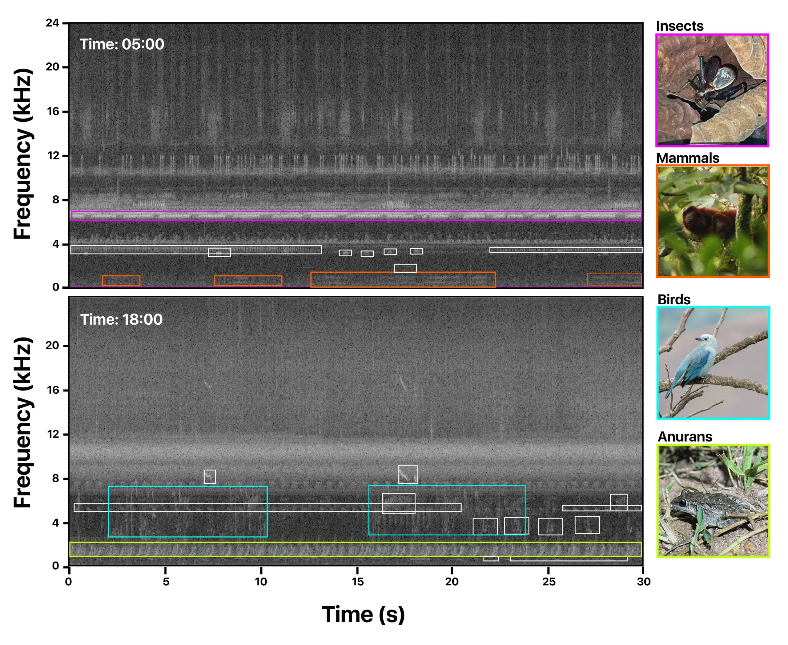

# El Silencio: A passive acoustic monitoring dataset for multi-taxonomic identification in the Middle Magdalena, Colombia

<div align="center">

</div>

We introduce **El Silencio**, a new bioacoustics dataset designed to benchmark multi-taxonomic identification using passive acoustic monitoring. The dataset features 770 one-minute soundscape recordings captured by AudioMoth recorders in the Middle Magdalena Medio region of Colombia during March and August 2023. These recordings, totalling 12.8 hours, were collected from seven sites with varying forest compositions, with a focus on dawn and dusk periods when biological activity is highest. The dataset contains approximately 15,000 strongly labelled bounding boxes representing four different taxonomic groups (check here the annotation [protocol](https://github.com/redecoacustica/elsilencio-dataset/blob/main/Protocol.pdf) in Spanish). You can read more about the context of the project [here](https://experiment.com/u/oDaVbQ).

**[Download El Silencio](test)**

Additionally, we open 11,340 unlabeled soundscapes from the same region. These files correspond to 63 sites (180 files per site) during all possible hours and days of the collection. We open unlabeled soundscapes to explore potential algorithmic approaches that use unlabeled data to improve species identification models.

**[Download Unlabeled Soundscapes](test)**

El Silencio was also used as a test set for the [BirdCLEF+2025](https://www.kaggle.com/competitions/birdclef-2025) Challenge. By making this dataset available, we aim to foster collaboration between machine learning researchers and ecologists to better understand how global change is impacting biodiversity. 

We thank Earth Species Project, Experiment.com and Footprint Coalition under a Science Engine grant, AI for Interspecies Communication, for the initial [grant](https://experiment.com/projects/a-benchmark-toward-an-end-to-end-machine-learning-system-for-acoustic-monitoring-wildlife-populations-and-ecosystems) that allowed the starting of the building of the dataset.

## Citing this work

If you found El Silencio useful, please consider citing the paper:

```
@article{canas2025birdclef25,
  title={Overview of {BirdCLEF+} 2025: Multi-Taxonomic Sound Identification in the Middle Magdalena, Colombia},
  author={Cañas, Juan Sebastián and Kahl, Stefan and Denton, Tom and Toro-Gómez, Maria Paula and Rodriguez-Buritica, Susana and Benavides-Lopez, Jose Luis and Ulloa, Juan Sebastián and Caycedo-Rosales, Paula and Klinck, Holger and Glotin, Herv{\'e} and Go{\"e}au, Herv{\'e} and Vellinga, Willem-Pier and Planqu{\'e}, Robert and Joly, Alexis},
  journal={Working Notes of CLEF 2025 - Conference and Labs of the Evaluation Forum},
  year={2025}
}
```
